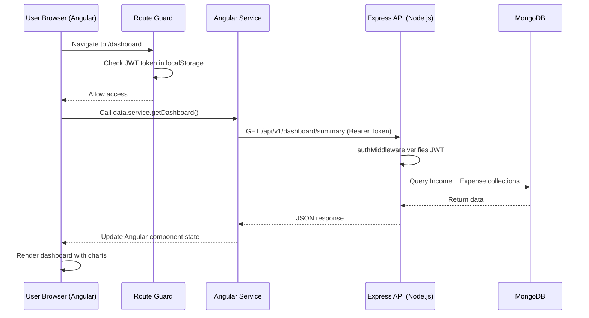

# 💰 Money Management App — Full Project Documentation

> A full-stack personal finance management web application built with **Angular** (frontend) and **Node.js / Express / MongoDB** (backend).

---

## 📌 What Is This Project?

The **Money Management App** is a web application that allows users to **track their income, expenses, savings goals, budgets, and generate financial reports** — all in one place. It also features a dedicated **admin panel** to monitor all users and their financial activity from a high level.

It is designed for:
- **Regular users** who want to manage their personal finances
- **Admin users** who need system-wide oversight and moderation tools

---

## 🏗️ Technology Stack

### Frontend
| Technology | Purpose |
|---|---|
| **Angular** (latest) | SPA framework, component-based UI |
| **TypeScript** | Strongly-typed Angular components & services |
| **Chart.js** | Interactive financial charts and graphs |
| **Font Awesome** | Icons throughout the UI |
| **Google Fonts** | Premium typography |
| **CSS (Vanilla)** | Custom styling, glassmorphism, dark mode, animations |

### Backend
| Technology | Purpose |
|---|---|
| **Node.js** | JavaScript runtime |
| **Express.js v5** | REST API web framework |
| **MongoDB** | NoSQL database for all data storage |
| **Mongoose** | MongoDB ODM (Object Document Mapper) |
| **JWT (jsonwebtoken)** | Authentication tokens (30-day expiry) |
| **bcryptjs** | Password hashing |
| **Helmet** | HTTP security headers |
| **CORS** | Cross-origin request handling |
| **express-rate-limit** | Rate limiting (200 req / 15 min per IP) |
| **compression** | Gzip response compression |
| **dotenv** | Environment variable management |
| **nodemon** | Dev server auto-restart |

---

## 📁 Project Structure

```
money mangement project -angular/
│
├── backend/                        # Node.js REST API
│   ├── config/
│   │   └── db.js                   # MongoDB connection
│   ├── controllers/
│   │   ├── authController.js       # Register, Login, Profile
│   │   ├── adminController.js      # Admin user/stat/transaction management
│   │   ├── reportController.js     # Advanced analytics & reports
│   │   ├── dashboardController.js  # User dashboard summary
│   │   ├── expenseController.js    # Expense CRUD
│   │   ├── incomeController.js     # Income CRUD
│   │   ├── savingController.js     # Saving goals CRUD
│   │   └── categoryController.js  # Custom category CRUD
│   ├── middleware/
│   │   ├── authMiddleware.js       # JWT token verification
│   │   ├── adminMiddleware.js      # Admin role check
│   │   ├── responseCache.js        # In-memory response caching
│   │   └── errorHandler.js        # Global error handling
│   ├── models/
│   │   ├── User.js                 # User schema
│   │   ├── Expense.js              # Expense schema
│   │   ├── Income.js               # Income schema
│   │   ├── SavingGoal.js           # Saving goal schema
│   │   └── Category.js             # Category schema
│   ├── routes/
│   │   ├── authRoutes.js           # /api/auth/*
│   │   ├── incomeRoutes.js         # /api/v1/income/*
│   │   ├── expenseRoutes.js        # /api/v1/expense/*
│   │   ├── categoryRoutes.js       # /api/v1/category/*
│   │   ├── savingRoutes.js         # /api/v1/saving/*
│   │   ├── dashboard.js            # /api/v1/dashboard/*
│   │   └── adminRoutes.js          # /api/v1/admin/*
│   ├── .env                        # Environment variables (PORT, MONGO_URI, JWT_SECRET)
│   ├── server.js                   # Entry point
│   └── package.json
│
└── money-management-frontend/      # Angular SPA
    └── src/app/
        ├── auth/                   # Login & Register pages
        │   ├── login/
        │   └── register/
        ├── dashboard/              # User Dashboard
        ├── income/                 # Income management
        ├── expenses/               # Expense management
        ├── budget/                 # Budget tracking
        ├── savings/                # Saving goals
        ├── reports/                # User financial reports
        ├── settings/               # User account settings
        ├── sidebar/                # Navigation sidebar component
        ├── admin/                  # Admin-only section
        │   ├── layout/             # Admin shell/layout
        │   ├── dashboard/          # Admin dashboard
        │   ├── users/              # User management
        │   ├── transactions/       # Transaction monitoring
        │   ├── reports/            # System reports
        │   └── settings/           # Admin settings
        ├── services/               # Angular services
        ├── guards/                 # Route guards
        ├── pipes/                  # Custom Angular pipes
        └── utils/                  # Utility helpers
```

---

## 🗃️ Database Models

### 👤 User
```
name          String     Required
email         String     Required, Unique
password      String     Required (bcrypt hashed)
preferences:
  currency    String     Default: 'USD'
  notifications Boolean  Default: true
  theme       String     Default: 'light'
role          String     'user' | 'admin' (Default: 'user')
timestamps    createdAt, updatedAt
```

### 💸 Expense
```
user          ObjectId → User    Required
title         String             Required, max 50 chars
amount        Number             Required
type          String             Default: "expense"
date          Date               Required
category      String             Required
description   String             Optional, max 100 chars
timestamps    createdAt, updatedAt
Indexes: { user, date }, { amount }
```

### 💵 Income
```
user          ObjectId → User    Required
title         String             Required, max 50 chars
amount        Number             Required
type          String             Default: "income"
date          Date               Required
category      String             Required
description   String             Required, max 20 chars
timestamps    createdAt, updatedAt
Indexes: { user, date }, { amount }
```

### 🏦 SavingGoal
```
user           ObjectId → User   Required
title          String            Required
targetAmount   Number            Required
currentAmount  Number            Default: 0
icon           String            Default: 'fa-solid fa-piggy-bank'
color          String            Default: '#5C9CE6'
timestamps     createdAt, updatedAt
```

### 🏷️ Category
```
user          ObjectId → User    Required
name          String             Required, max 50 chars
type          String             'income' | 'expense'
icon          String             Default: 'tag'
color         String             Default: '#cccccc'
budgetLimit   Number             Default: 0
timestamps    createdAt, updatedAt
Unique Index: { user, name, type }
```

---

## 🔌 Backend API Endpoints

### 🔐 Auth Routes — `/api/auth`
| Method | Endpoint | Access | Description |
|---|---|---|---|
| POST | `/register` | Public | Register a new user |
| POST | `/login` | Public | Login and get JWT token |
| GET | `/profile` | Private | Get logged-in user profile |
| PUT | `/profile` | Private | Update name, email, password, preferences |

### 💵 Income Routes — `/api/v1`
| Method | Endpoint | Access | Description |
|---|---|---|---|
| GET | `/income` | Private | Get all income for user |
| POST | `/income` | Private | Add new income entry |
| DELETE | `/income/:id` | Private | Delete an income entry |

### 💸 Expense Routes — `/api/v1`
| Method | Endpoint | Access | Description |
|---|---|---|---|
| GET | `/expense` | Private | Get all expenses for user |
| POST | `/expense` | Private | Add new expense entry |
| DELETE | `/expense/:id` | Private | Delete an expense entry |

### 🏷️ Category Routes — `/api/v1/category`
| Method | Endpoint | Access | Description |
|---|---|---|---|
| GET | `/` | Private | Get all user categories |
| POST | `/` | Private | Create a category |
| DELETE | `/:id` | Private | Delete a category |

### 🏦 Saving Routes — `/api/v1/saving`
| Method | Endpoint | Access | Description |
|---|---|---|---|
| GET | `/goals` | Private | Get all saving goals |
| POST | `/goals` | Private | Create a saving goal |
| PUT | `/goals/:id` | Private | Update a saving goal |
| DELETE | `/goals/:id` | Private | Delete a saving goal |

### 📊 Dashboard Route — `/api/v1/dashboard`
| Method | Endpoint | Access | Description |
|---|---|---|---|
| GET | `/summary` | Private | Get income/expense summary for dashboard |

### 🛡️ Admin Routes — `/api/v1/admin`
| Method | Endpoint | Access | Description |
|---|---|---|---|
| GET | `/users` | Admin | Get all users (paginated) |
| GET | `/stats` | Admin | System-wide statistics |
| GET | `/reports` | Admin | Full analytics report data |
| GET | `/transactions` | Admin | All transactions with filters |
| DELETE | `/users/:id` | Admin | Delete user + all their data |
| DELETE | `/transactions/:type/:id` | Admin | Delete a specific transaction |
| PUT | `/change-password` | Admin | Admin password change |

---

## 🖥️ Frontend Pages & Routes

### 👤 User Pages
| Route | Page | Description |
|---|---|---|
| `/login` | Login | Auth page (redirects if already logged in) |
| `/register` | Register | New user registration |
| `/dashboard` | Dashboard | Overview: balance, recent transactions, charts |
| `/income` | Income | Add/view/delete income entries |
| `/expenses` | Expenses | Add/view/delete expense entries |
| `/budget` | Budget | Budget tracking per category |
| `/savings` | Savings | Savings goals with progress tracking |
| `/reports` | Reports | Personal financial charts and analytics |
| `/settings` | Settings | Profile, currency, theme preferences |

### 🛡️ Admin Pages (under `/admin`)
| Route | Page | Description |
|---|---|---|
| `/admin/dashboard` | Admin Dashboard | System stats: total users, income, expenses, trends |
| `/admin/users` | User Management | View, paginate, delete users |
| `/admin/transactions` | Transaction Monitor | View/filter/delete all system transactions |
| `/admin/reports` | System Reports | Advanced analytics: Monthly Revenue Matrix, User Risk Signals, etc. |
| `/admin/settings` | Admin Settings | Admin password change, admin-specific currency setting |

---

## 🧩 Angular Services

| Service | Purpose |
|---|---|
| `auth.service.ts` | Login, register, logout, JWT token management |
| `data.service.ts` | Income, expense, dashboard, category, savings API calls |
| `admin-data.service.ts` | All admin API calls (users, stats, reports, transactions) |
| `currency.service.ts` | User currency preference (stored in localStorage) |
| `admin-currency.service.ts` | Admin-specific currency display (isolated from user currency) |
| `theme.service.ts` | Dark/light mode toggle, stored in user preferences |
| `sidebar.service.ts` | Sidebar open/close state management |
| `api.service.ts` | Base API URL config |
| `expense.service.ts` | Expense-specific operations |

---

## 🔒 Route Guards

| Guard | Purpose |
|---|---|
| `auth.guard.ts` | Protects user routes — redirects to `/login` if not authenticated |
| `admin.guard.ts` | Protects `/admin/*` routes — checks if user has `role: 'admin'` |
| `no-auth.guard.ts` | Prevents logged-in users from accessing login/register pages |

---

## 🛡️ Security Features

- **JWT Authentication** — Tokens valid for 30 days; sent in `Authorization: Bearer <token>` header
- **Password Hashing** — bcryptjs with 10 salt rounds
- **Admin Middleware** — Double-checks `role === 'admin'` on every admin route
- **Rate Limiting** — 200 requests per 15 minutes per IP
- **Helmet** — Sets HTTP security headers (CSP, HSTS, X-Frame-Options: DENY, etc.)
- **CORS** — Credential-supporting CORS with configurable origins
- **No Caching** — Global `Cache-Control: no-store` headers to prevent stale auth data
- **Input Validation** — Field-level validation on all models with Mongoose
- **Password Cascade Delete** — Deleting a user also deletes all their income and expenses

---

## ⚡ Performance Features

- **In-Memory Caching** — Admin controller caches `/stats` and `/users` responses for 2 minutes
- **Response Cache Middleware** — `responseCache.js` provides a 30-second cache for GET routes
- **Gzip Compression** — All API responses are compressed via `compression` middleware
- **MongoDB Indexes** — Compound indexes on `(user, date)` and `(amount)` for Expense and Income collections
- **ETag Disabled** — Prevents unnecessary 304 comparisons
- **Angular Lazy Loading** — All pages are lazy-loaded, reducing initial bundle size

---

## 🎨 UI/UX Features

- **Dark / Light Mode** — Toggleable theme stored in user preferences
- **Currency Switcher** — User can set their preferred currency (e.g., USD, EUR, INR); admin has a separate setting
- **Glassmorphism Design** — Cards and panels use blur/glass aesthetic
- **Animated Backgrounds** — Auth pages feature dynamic animated backgrounds
- **Password Visibility Toggle** — Shown/hidden password with Font Awesome icons
- **Password Strength Indicator** — Visual indicator on registration page
- **Responsive Layout** — Works on desktop and mobile screens
- **Paginated Tables** — Admin Users page uses server-side pagination
- **Chart.js Charts** — Bar charts for income vs expense trends on dashboard and reports
- **Premium Sidebar** — Collapsible navigation sidebar for all user/admin pages

---

## 🚀 How to Run the Project Locally

### 1. Backend
```bash
cd "backend"
# Make sure .env has: MONGO_URI, JWT_SECRET, PORT=5001
npm install
npm start         # Runs with nodemon on http://localhost:5001
```

### 2. Frontend
```bash
cd "money-management-frontend"
npm install
ng serve          # Runs on http://localhost:4200
```

> Make sure MongoDB is running before starting the backend.

---

## 🔄 How It All Works Together — Data Flow



---

## 📋 Project Summary

| Item | Detail |
|---|---|
| **Type** | Full-Stack Web Application |
| **Architecture** | SPA Frontend + REST API Backend |
| **Auth** | JWT-based, role-based (user / admin) |
| **Database** | MongoDB with Mongoose ODM |
| **API Style** | RESTful JSON API |
| **Frontend Framework** | Angular (standalone components, lazy-loaded routes) |
| **Backend Port** | 5001 (default) |
| **Frontend Port** | 4200 (Angular dev server) |
| **User Roles** | `user`, `admin` |
| **Total API Routes** | ~20 endpoints |
| **Total Frontend Pages** | 14 pages (9 user + 5 admin) |
